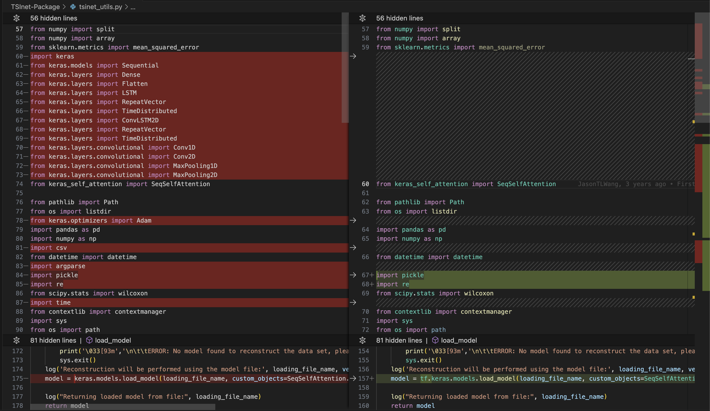
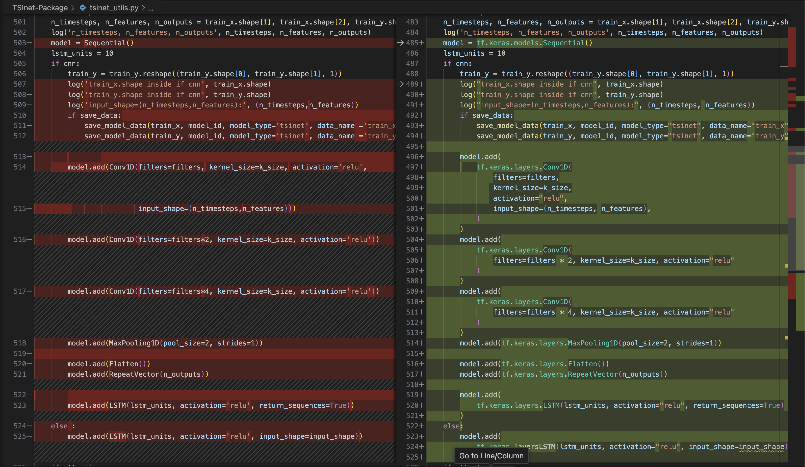
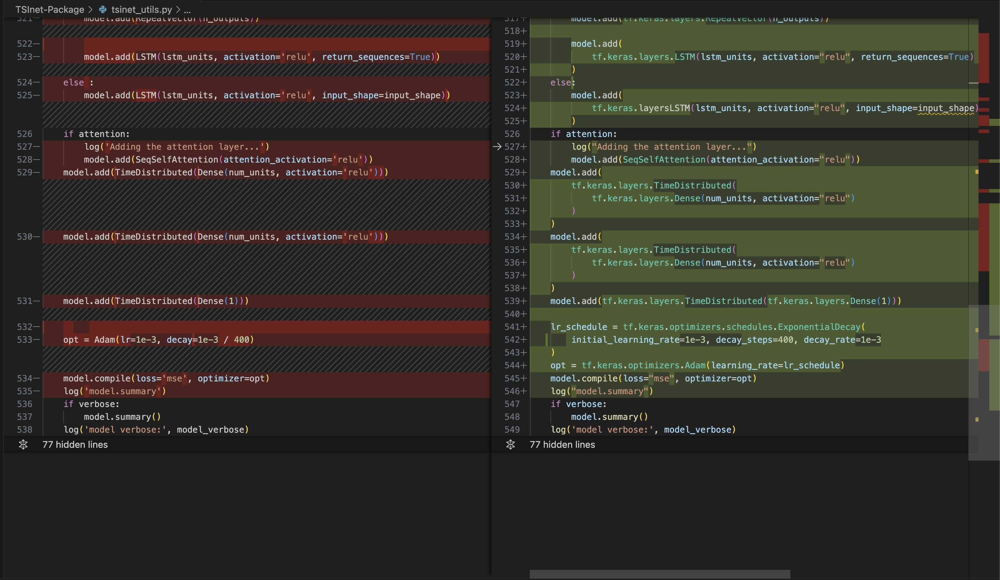

# CHANGELOG (3rd Feb 2024)

## System configuration

* Hardware - Apple M2 Pro Chip
* OS - MacOS 14.3
* Python version - v3.8.18
* Pip - v23.0.1

## Package Versions

1. numpy==1.24.3
2. keras==2.13.1
3. keras_self_attention==0.51.0
4. pandas==2.0.3
5. scikit-learn==1.3.2
6. scipy==1.10.1
7. tensorflow==2.13.0
8. tensorflow-metal - Optional and only for Apple silicon

## Code Change

1. tsinet_utils.py

   The screenshots are git diff of the modified files. The **left section** in **red** is **old code** and **right section** in **green** is **new code**.

   

   

   
